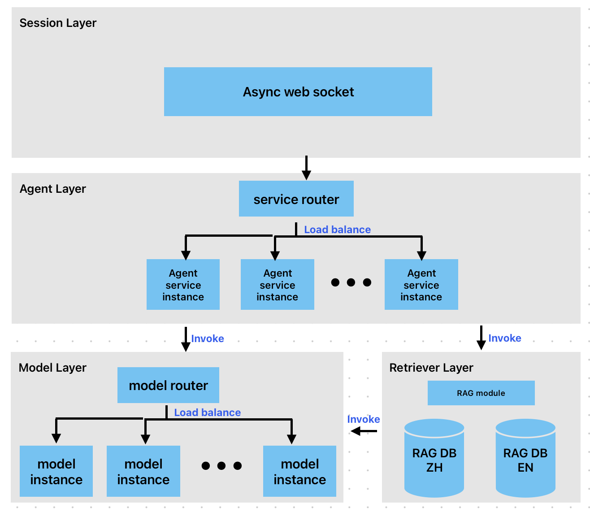
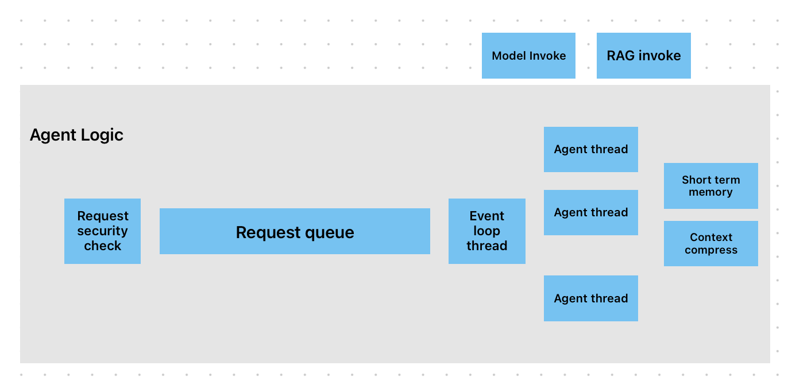
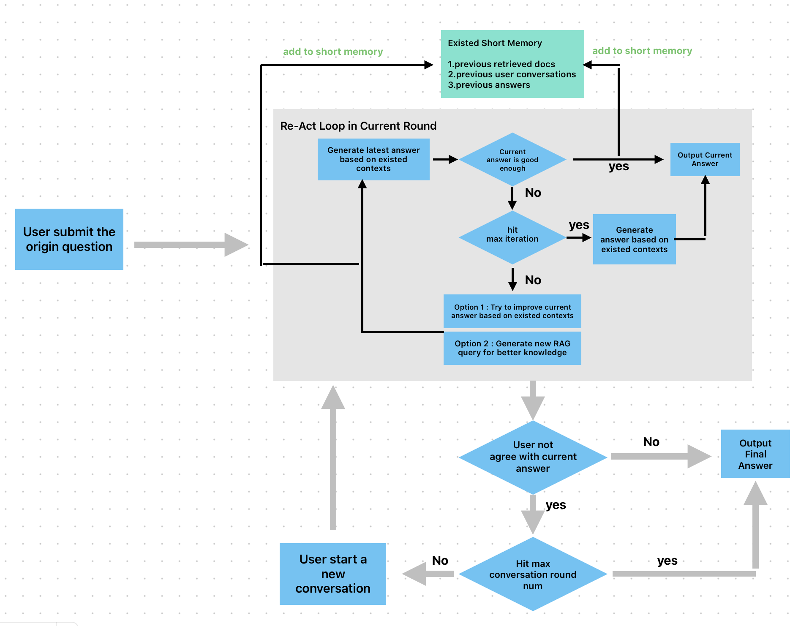

# Project Overall Architecture & Feature Introduction
Implement a high-concurrency, scalable professional-domain Agent Q&A service.

## Overall Architecture

The project is divided into four layers:
1. **Session Layer**: Supports high-concurrency conversations based on asynchronous WebSocket.
2. **Agent Layer**: Optimizes requests using multiple Agent service instances with load balancing.
3. **Model Layer**: Also deploys multiple service instances independently, achieving balanced model invocation performance through model routing and load balancing.
4. **RAG Layer**: Built on Milvus.

## Agent Architecture Design


1. Implements Agent interaction logic based on an event-driven model. Requests are first placed into a queue; an event loop then fetches requests and assigns them to Agent threads for execution.
2. The internal Agent is designed following the ReAct model. In each conversation round, the Agent can iterate multiple times to obtain the best answer.
3. Supports short-term memory storage and context compression (mainly based on LLM summarization).
4. Supports pre-checking query security (e.g., prompt injection attacks). This feature is currently mocked and not yet fully implemented.

## RAG Architecture Design
1. Supports dense (semantic-level) and sparse (keyword-level) vector storage and querying.
2. Supports reranking.
3. Supports pre-optimization of queries (e.g., splitting a fuzzy query into multiple precise queries).
4. Supports sensitive data filtering on original documents.

## Functional Indicators
1. **Multi-turn conversation support**: Each conversation round is iteratively optimized based on the ReAct pattern before generating the final answer.
    - (1) Limits on maximum number of iterations and conversation turns.
    - (2) In each iteration, the Agent evaluates whether the current answer is the best so far; if so, the iteration ends early.
2. **RAG part**
    - (1) Supports basic vector search and hybrid search (configuration-driven).
    - (2) The hybrid search has been optimized: it combines semantic dense vectors with sparse vectors based on exact keyword matching (e.g., BM25 algorithm), rather than using a vector + plain text hybrid search. This can be toggled via the `"hybrid"={true,false}` setting in the project directory `rag_agent_case_study/conf/rag.json`.
    - (3) Both basic search and hybrid search can be followed by a rerank refinement step. This can be toggled via the `"rerank"={true,false}` setting in `rag_agent_case_study/conf/rag.json`.
    - (4) Query pre-optimization (e.g., splitting a fuzzy query into multiple more precise queries before sending to RAG retrieval).
3. **Question compliance check**
    - (1) Filters questions with security risks or those irrelevant to the professional domain using an LLM. The filtering prompt can be found at `rag_agent_case_study/{en,zh}/prompt/question_check.pmt`. The filtering model uses the DeepSeek-V4 series.
    - (2) Filters based on simple rules defined in `rag_agent_case_study/conf/risk_rules.txt`. Determines compliance by comparing the semantic similarity between the input question and the defined rules (this method can only be used for security risk checks).
    - (3) The method can be chosen by setting `"security_check"` to `"MODEL"`, `"RULE"`, or `"NONE"` in `rag_agent_case_study/conf/agent.json`, allowing a trade-off between performance and filtering effectiveness.
4. **Data security**
    - (1) For sensitive data at PII level or above, a dedicated PII-masking LLM is used for data masking (reference: https://milvus.io/docs/zh/RAG_with_pii_and_milvus.md#Build-RAG-with-Milvus-+-PII-Masker).
    - (2) Data is masked before embedding into the RAG database, and logs are also masked before being written.

## Non-functional & Quantitative Indicators
### 1. Observability
**a.** A complete Agent conversation round can be described as the following trace:
- User initiates request → Router service receives and forwards the request to a specific Agent instance → Request compliance check → Request enters queue → Agent thread fetches request from queue and starts iterations {each iteration involves interaction with the Model layer or RAG layer} → Return result.

**b.** For each specific action in the trace, the log format is as follows:
```json
{ 
  "action_name" : "xxx", 
  "context" : { ... }, 
  "start_time" : "xxx", 
  "end_time" : "xxx",  
  "trace_id" : "xxx",  
  "action_id" : "xxx",
  "source_id" : "xxx",
  "error" : "xxx"
}
```
- `trace_id` is generated when the user initiates the request, enabling tracing of the entire chain.
- `source_id` is the `action_id` of the upstream action (facilitating upstream tracing).
- `action_id` is the ID of the current action.

**Example logs:**
- Interaction between Agent and RAG:
  1. Agent layer
  ```json
  {
    "action_name" : "agent_process",
    "context" : {
      "round_num" : 1,
      "iteration_num" : 2,
      "rag_query" : "How long does it take to settle a claim for a small-amount medical insurance?",
      "rag_result" : [...],
      "model_result" : "Model generated answer"
    },
    "action_id" : "31e989b14f5d4d778013e65ab7073bae",
    "source_id" : "...",
    "trace_id" : "...",
    "start_time" : "...",
    "end_time" : "..."
  }
  ```
  2. RAG layer
  ```json
  {
    "action_name" : "rag_retrieve",
    "context" : {
      "query" : "How long does it take to settle a claim for a small-amount medical insurance?",
      "query_embedding" : [...],
      "result" : [...],
      "hybrid" : false
    },
    "action_id" : "994969903cee483e978c3e0fee801ede",
    "source_id" : "31e989b14f5d4d778013e65ab7073bae",
    "trace_id" : "...",
    "start_time" : "...",
    "end_time" : "..."
  }
  ```
  3. Model layer
  ```json
  {
    "action_name" : "model_infer",
    "context" : {
      "model_name" : "deepseekV4",
      "model_usage" : "agent",
      "instance_port" : 8988
    },
    "action_id" : "...",
    "source_id" : "994969903cee483e978c3e0fee801ede",
    "trace_id" : "...",
    "start_time" : "...",
    "end_time" : "..."
  }
  ```

### 2. Effectiveness Metrics
**a. RAG Retrieval Effectiveness Evaluation (Precision, Recall, Faithfulness)**
- To accurately evaluate RAG retrieval, all input documents were split into multiple document chunks (using LangChain's RecursiveCharacterTextSplitter). For each query, the most relevant N chunks were identified through a combination of human judgment and LLM assistance, and then used together with the final Agent answer to calculate the following metrics.
- **Average Precision@TopK**  
  Sum( Number of relevant chunks among the returned K chunks / K ) / Number of queries
- **Average Recall@TopK**  
  Sum( Number of relevant chunks among the returned K documents / Total number of relevant chunks for the query ) / Number of queries
- **Average Faithfulness** (based on RAGAS)  
  Sum( Faithfulness score calculated by LLM based on {query, answer, retrieved documents} ) / Number of queries
- The final metrics are calculated as follows (10 queries total; the table shows average metrics over the 10 queries):

|                           | Average Precision | Average Recall | Faithfulness |
|---------------------------|-------------------|----------------|--------------|
| Basic Vector Retrieval    | 0.7               | 0.46           | 0.83         |
| Hybrid Retrieval          | 0.8               | 0.53           | 0.88         |
| Basic Retrieval + Rerank  | 0.9               | 0.6            | 0.87         |
| Hybrid Retrieval + Rerank | 0.8               | 0.53           | 0.92         |

**b. RAG Answer Generation Effectiveness Evaluation (Compliance, Style Consistency, Accuracy, Refusal Rate)**
- **Average Accuracy** (based on semantic similarity between answer and ground truth)  
  Sum( Semantic similarity(ground truth answer, Agent returned answer) ) / Number of questions
- **Average Compliance Rate** (LLM-as-a-Judge, compliance check prompt reference)  
  Sum( Compliance rate computed by LLM based on {answer, related documents} ) / Number of questions
- **Average Style Consistency Rate** (LLM-as-a-Judge, style check prompt reference)  
  Sum( Style consistency rate computed by LLM based on {answer, related documents} ) / Number of questions
- **Refusal Rate** (basic agent prompt already includes question compliance check)  
  Sum( LLM refuses to answer the question ) / Number of questions
- The final metrics are as follows (10 legitimate queries and 10 illegitimate queries; table numbers are average metrics for the respective 10 questions):

|                           | Avg Accuracy | Avg Compliance Rate | Avg Style Consistency | Refusal Rate (on illegitimate questions) |
|---------------------------|--------------|---------------------|-----------------------|------------------------------------------|
| Basic Vector Retrieval    | 0.74         | 0.81                | 0.87                  | 0.9                                      |
| Hybrid Retrieval          | 0.73         | 0.88                | 0.75                  | 0.9                                      |
| Basic Retrieval + Rerank  | 0.77         | 0.75                | 0.83                  | 0.9                                      |
| Hybrid Retrieval + Rerank | 0.82         | 0.85                | 0.74                  | 0.9                                      |

### 3. Engineering Metrics
**a. Performance Evaluation**
- Conducted 1000 conversations at different throughput levels (1 request/second, 5 requests/second, 10 requests/second), and collected metrics such as average latency, worst latency, Agent iteration count, and token consumption for these 1000 conversations.
- Because this is an end-to-end evaluation, the RAG strategy for performance testing was fully enabled: Hybrid Retrieval + Rerank + Query Optimization (e.g., splitting fuzzy queries into multiple precise queries).
- Token and iteration count comparisons were made only between two strategies: RAG Basic Vector and RAG Hybrid Retrieval + Rerank.

*Full chain latency metrics:*
| Throughput   | Metric        | Full Chain | Agent Queue Fetch Task | Agent Execution (all iterations completed) | Agent Single Iteration Query Model |
|--------------|---------------|------------|------------------------|---------------------------------------------|-------------------------------------|
| 1 req/s      | Worst Latency | 52s        | 20ms                   | 50s                                         | 4s                                  |
|              | Avg Latency   | 31s        | 12ms                   | 30s                                         | 2s                                  |
| 5 req/s      | Worst Latency | 46s        | 22ms                   | 45s                                         | 6s                                  |
|              | Avg Latency   | 29s        | 14ms                   | 28s                                         | 4s                                  |
| 10 req/s     | Worst Latency | 49s        | 25ms                   | 48s                                         | 5s                                  |
|              | Avg Latency   | 31s        | 13ms                   | 30s                                         | 2s                                  |

*RAG sub-process latency metrics:*
| Throughput   | Metric        | RAG Query Optimization | RAG Embedding Query | RAG Hybrid Retrieval | RAG Rerank |
|--------------|---------------|------------------------|---------------------|----------------------|------------|
| 1 req/s      | Worst Latency | 4s                     | 2s                  | 100ms                | 3s         |
|              | Avg Latency   | 2s                     | 1s                  | 70ms                 | 1s         |
| 5 req/s      | Worst Latency | 3s                     | 2s                  | 90ms                 | 4s         |
|              | Avg Latency   | 1s                     | 1s                  | 60ms                 | 2s         |
| 10 req/s     | Worst Latency | 4s                     | 3s                  | 95ms                 | 3s         |
|              | Avg Latency   | 2s                     | 1s                  | 77ms                 | 1s         |

- From the data above, it can be seen that due to the event-driven design, multi-instance deployment, and load balancing optimization, latency does not increase significantly with concurrency.
- Additionally, because the project design is based on ReAct, the Agent iterates multiple times in a single conversation round, resulting in relatively high single-round latency.

*Token consumption and iteration count (single dialogue round):*
| Strategy                  | Input Tokens per Dialogue | Output Tokens per Dialogue | Agent Iterations per Dialogue |
|---------------------------|---------------------------|----------------------------|-------------------------------|
| Basic Vector Retrieval    | 4500                      | 510                        | 6                             |
| Hybrid Retrieval + Rerank | 1720                      | 206                        | 2                             |

- Since the project uses a short-term memory module without enabling context compression, the model input token consumption is relatively high.
- From the data above, hybrid retrieval + rerank effectively improves the quality of returned documents and reduces the number of model optimization iterations.

### 4. Troubleshooting
- **a.** When the Agent conducts multiple conversation rounds (3 or more), with each round reaching the maximum iteration count, but the returned answers have accuracy and compliance rates both below 60%.
    - Root cause still under investigation.
- **b.** When user questions are highly irrelevant (e.g., the Agent project is designed for internal knowledge Q&A at an insurance company), and a user asks, "Where is the most cost-effective restaurant in Shanghai?", the Agent does not refuse to answer.
    - Preliminary investigation (based on RAG returned documents and prompt design) suggests there may be semantically related fragments in the RAG corpus, and the compliance check design in the query prompt also needs further optimization.
